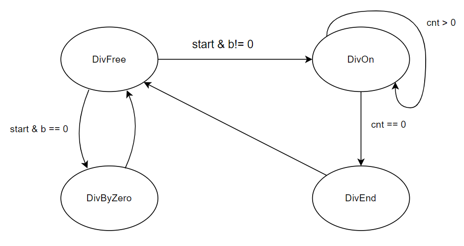
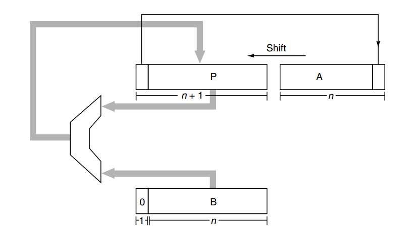
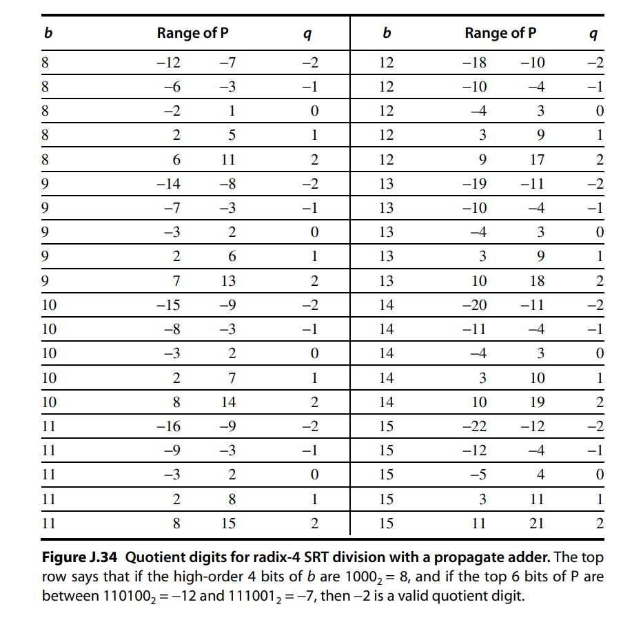
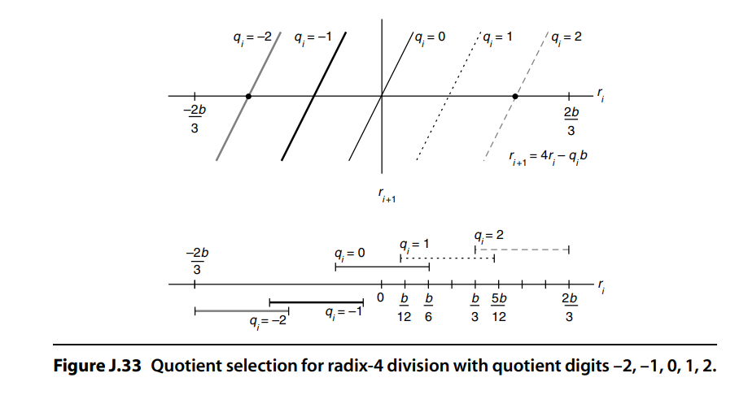

#### **摘要**

实现了一个同时支持有符号和无符号8位除法的Radix-4 SRT算法。对于有负数参与的有符号除法，先把负数都转化为正数，等到计算结束后再修正结果。

#### 原理简述

对于一个决策，我们通常说参考的依据越多，做出来可能就会越高效。在常规的除法中，每一轮循环其实是通过**试探**的方法来作决策的，这里面没有任何的参考依据，理所当然造成了低效

SRT施展了一些小技巧：每次循环中，通过观察P和B的前几位，可以大致知道他们当前所属的范围。然后对比这个范围信息就可以做出更好的决策了(比如知道两个数差距悬殊后，可以直接一次减去多倍，不用一倍一倍慢慢地试探)

#### 状态机图



每个状态负责的工作：

divFree：检测启动信号，然后根据除数是否等于0，跳转到divOn或者divByZero状态。如果目标状态是divOn的话还要做一些初始化工作

divOn：除法正常进行中。每轮迭代会选出一个商，并更新余数。设置了一个计数器用来控制迭代次数

divEnd：迭代过程结束，对结果做一些修改。随后转化为divFree状态

divByZero：报告错误，随后转化为divFree状态

不写成状态机也可以，这么写主要是感觉显得更清晰一些

#### 电路结构



<center>基于shift-add结构。一次可以左移两位</center>

#### 算法步骤

总共需要花费1+4+1=6个周期。假设要计算的是a / b，每个周期负责的工作如下：

#1：设置P、A、B三个寄存器，其中PA实际上也被拼接到一起。他们的初始值如下：

```
P = 0; 
A = a;
B = b;
```

然后计算出b的前导0个数k，将{P, A}和B一起左移k位。这保证了B的最高位为1，这里隐藏了一个信息：经过处理后的**B必定大于8位二进制所能表示的最大无符号数的一半**。这可以作为后续选商时候的一个参考

#2-5：进入一个迭代过程。余数R被保存在P寄存器中，其迭代过程如下：
$$
R_{i+1} = 4R_{i} - q_iB
$$
q<sub>i</sub>的值取决于每轮迭代过程中，P和B高位的情况。查找表如下：



至于商的处理是通过设置两个累加器，一个用于保存正商另一个用来保存负商。每轮迭代中选出一个商位后，将它赋以一定权重后放入其中一个累加器。

#6：当迭代结束后产生的余数为负时，需要做恢复工作。具体方法就是往P中加回一倍的B，并对商做减一。最后把{P, A}右移k位，这时候P里面的就是余数。商则可以通过给两个累加器做差得到

#### Robertson图



<center>用于描述余数迭代过程的图像</center>

#### 算法学习过程中的一些感想

https://zhuanlan.zhihu.com/p/550913605 （字数较多，且在语言表达上感觉有些缺少润色，不过欢迎有耐心的朋友们去看看）

#### 功能验证：

这里只提供了一个简单的verilog tb模块，可以手动设置输入然后观察波形图。主要的测试我是通过在verilator中把除法器模块接入我写的cpu项目，然后运行一些测试程序实现的。运行了所有的测试例结果都是正常。（但不排除仍有存在bug的可能）

#### 参考资料

https://eva.fing.edu.uy/pluginfile.php/199462/mod_folder/content/0/a_quantitative_approach_appendix_j.pdf